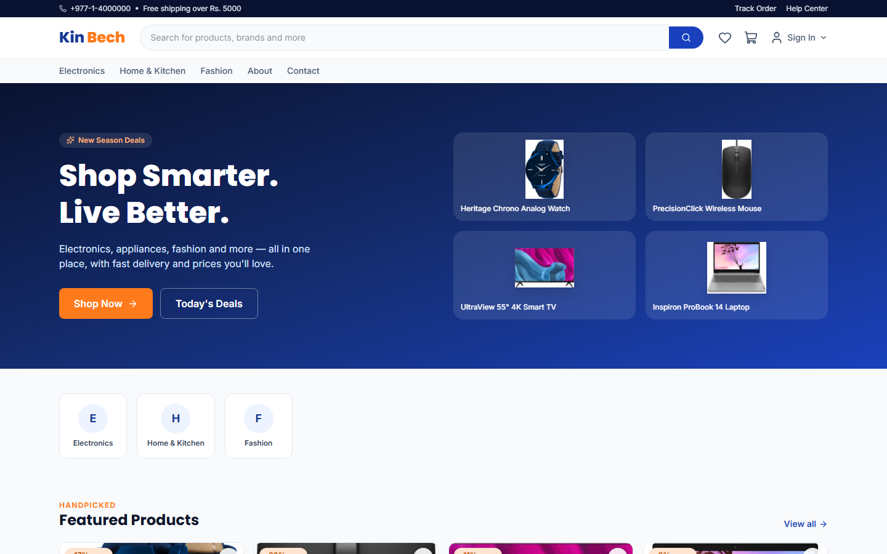
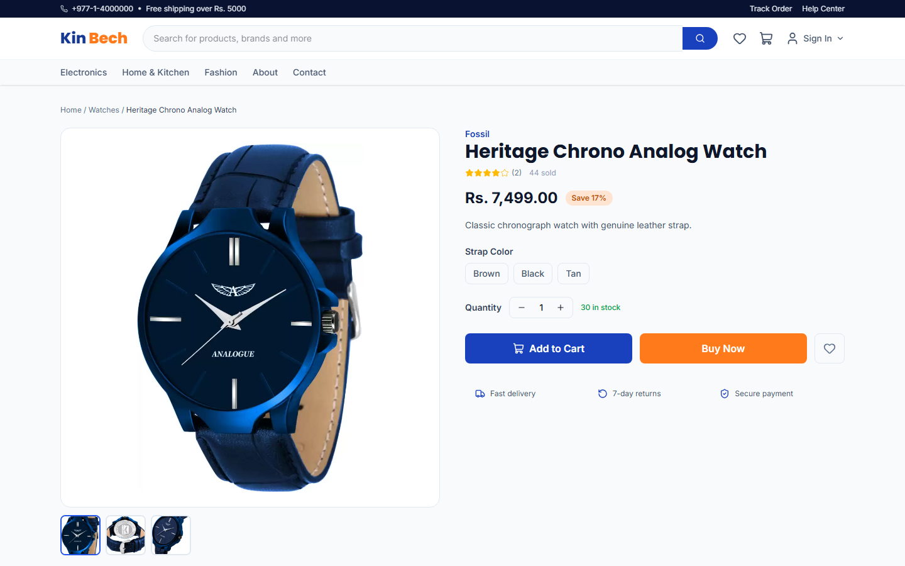
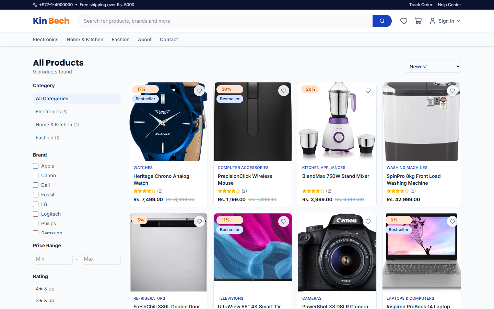
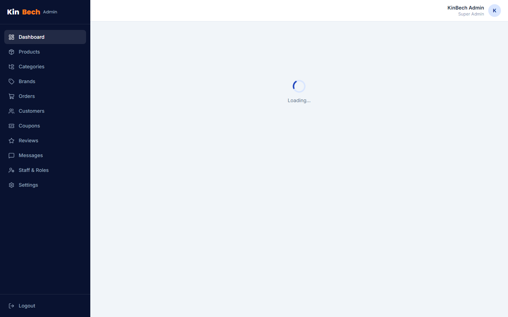
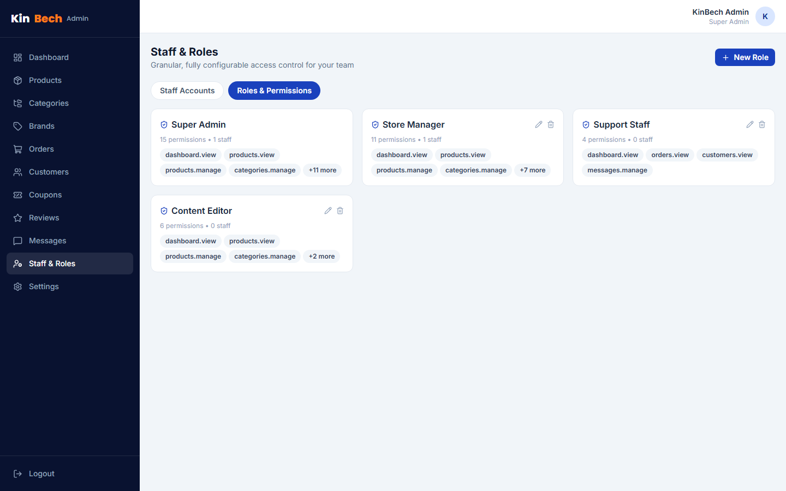

<div align="center">

# 🛍️ KinBech

**A full-stack, single-vendor e-commerce platform** — Laravel 13 REST API +
React 19 (Vite) storefront and admin panel.

Product catalog with variants and reviews, cart & wishlist, checkout,
order tracking, and an admin panel with **fully dynamic, role-based access
control** and **live-editable store settings** (including SMTP mail
configuration) — no `.env` edits or redeploys needed to change how the
store runs.


</div>

---

## 📺 Featured on YouTube — Techy Guy

This project is walked through end-to-end (build, architecture, and demo)
on the **Techy Guy** YouTube channel. If you found this repo from that
video, welcome! Everything you need to run it yourself is below.

> 🔗 *Video link — add it here once published.*

---

## 📖 About

KinBech started life as a plain PHP/MySQL student project (still preserved
at the repository root — see [Legacy PHP version](#-legacy-php-version)
below) and was rebuilt from scratch into a modern, decoupled full-stack
application: a Laravel API backend and a completely separate React SPA
frontend, talking to each other only over HTTP.

## ✨ Screenshots

| Storefront | Product Detail |
|---|---|
|  |  |

| Shop / Filters | Admin Dashboard |
|---|---|
|  |  |

| Roles & Permissions (granular access control) |
|---|
|  |

## 🚀 Features

**Storefront**
- Catalog browsing with category tree, brand/price/rating filters, search, sort, pagination
- Product detail pages with image galleries, variants (size/color/etc.), specs, and customer reviews
- Cart, wishlist, coupon codes, saved addresses
- Checkout with **Cash on Delivery** or a **simulated card payment** (no real gateway — safe to demo)
- Order history, a visual order-status tracking timeline, and order cancellation
- Account profile, contact form

**Admin panel** (`/admin`)
- Dashboard with revenue trend & top-product charts, low-stock alerts
- Product management: multi-image upload, variants, specifications, stock
- Category & brand management
- Order management with status updates that automatically email the customer
- Customer management, review moderation, contact-message inbox, coupon management
- **Granular, fully dynamic role-based access control** — create custom staff
  roles from any combination of ~15 permissions, assign them to staff
  accounts, and every admin API route enforces the assigned permissions
  server-side (powered by `spatie/laravel-permission`)
- **Dynamic store settings**, all stored in the database and applied instantly:
  - General branding, currency, and contact info
  - **Live SMTP mail configuration** with a "send test email" button — switch
    from log-only email to real SMTP delivery without touching code
  - Payment method toggles (COD / simulated card)
  - Shipping fee, free-shipping threshold, and tax rate
  - Social media links

## 🧰 Tech stack

| Layer | Choice |
|---|---|
| Backend | Laravel 13, MySQL, Sanctum (SPA cookie auth) |
| Authorization | `spatie/laravel-permission` (roles & granular permissions) |
| Audit trail | `spatie/laravel-activitylog` |
| Frontend | React 19, Vite, Tailwind CSS v4 |
| Data fetching | TanStack Query, Axios |
| Client state | Zustand |
| Forms & validation | react-hook-form + Zod |
| Charts | Recharts |
| Icons | lucide-react, react-icons |

## 🗂️ Project structure

```
KinBech-eCommerce/
├── backend/            Laravel 13 API
├── frontend/           React 19 + Vite SPA
├── scripts/            Local dev helper scripts
├── docs/screenshots/   Images used in this README
└── *.php, css/, js/    Original plain-PHP app (kept for reference)
```

---

## ⚡ Quick Start — run it in ~10 minutes

You need three things installed: **PHP 8.2+ with Composer**, **Node.js
18+ with npm**, and a **MySQL server**. If you don't have these yet, the
easiest route on Windows is an all-in-one bundle like
[Laragon](https://laragon.org/) or [XAMPP](https://www.apachefriends.org/)
(gives you PHP + MySQL together) plus [Node.js](https://nodejs.org/) from
its official installer. On macOS, `brew install php composer mysql node`
does the same. On Linux, use your distro's package manager.

Two terminals, run side by side — one for the API, one for the frontend.

### 1️⃣ Clone the repo

```bash
git clone https://github.com/harsh4dev/KinBech-eCommerce.git
cd KinBech-eCommerce
```

### 2️⃣ Backend (Laravel API) — Terminal 1

```bash
cd backend
composer install

cp .env.example .env
php artisan key:generate
```

Open `backend/.env` and make sure these match your MySQL setup (defaults
shown work with a fresh local MySQL where `root` has no password — typical
for XAMPP/Laragon):

```env
DB_CONNECTION=mysql
DB_HOST=127.0.0.1
DB_PORT=3306
DB_DATABASE=kinbech
DB_USERNAME=root
DB_PASSWORD=
```

Then create the database and load it up:

```bash
# create an empty "kinbech" database first (via phpMyAdmin, Adminer,
# HeidiSQL, or: mysql -u root -e "CREATE DATABASE kinbech;")

php artisan migrate --seed
php artisan storage:link
php artisan serve --port=8000
```

Leave this running. The API is now live at **http://localhost:8000**.

### 3️⃣ Frontend (React SPA) — Terminal 2

```bash
cd frontend
npm install

cp .env.example .env
npm run dev
```

Leave this running too. The store is now live at **http://localhost:5173**.

### 4️⃣ Open it up

| | URL | Login |
|---|---|---|
| 🛒 Storefront | http://localhost:5173 | *(browse as a guest, or register an account)* |
| 🔐 Admin panel | http://localhost:5173/admin/login | `admin@kinbech.test` / `password` |

Seeding also creates a **Store Manager** account (`manager@kinbech.test` /
`password`) with a reduced permission set — useful for trying out the
granular access control — and a **demo customer** (`customer@kinbech.test`
/ `password`), plus a demo catalog of 9 products and two working coupon
codes: `WELCOME10` and `FLAT500`.

### That's it 🎉

No payment gateway keys, no third-party API keys, and no manual data entry
are required to get a fully working store with real products, images, and
orders end-to-end.

---

## 🛠️ Troubleshooting

- **"could not find driver" / DB connection errors** — make sure PHP's
  `pdo_mysql` extension is enabled (`php -m | grep pdo_mysql`); on XAMPP/Laragon
  this is on by default.
- **CORS or "session not authenticated" errors in the browser console** —
  the frontend and backend URLs in `backend/.env` (`FRONTEND_URL`,
  `SANCTUM_STATEFUL_DOMAINS`) must exactly match the host **and port** the
  SPA runs on. `localhost` and `127.0.0.1` are different origins for
  cookies, so use `localhost` consistently for both.
- **Product/category images show as broken** — you skipped
  `php artisan storage:link`; run it from `backend/`.
- **Port already in use** — pass a different port to either command, e.g.
  `php artisan serve --port=8001`, and update `frontend/.env`'s
  `VITE_API_URL` to match.
- **Want to reset all the data?** `php artisan migrate:fresh --seed` from
  `backend/` wipes the database and reseeds the demo data from scratch.

## 🧪 End-to-end smoke test

`frontend/smoke-test.mjs` is a small Playwright script that loads every key
storefront and admin page (with both servers already running) and reports
any console/page errors — handy for confirming nothing broke after a change.

```bash
cd frontend
npx playwright install chromium   # first time only
node smoke-test.mjs
```

## ⚙️ Configuration notes

- **Mail**: defaults to the `log` driver — emails are written to
  `backend/storage/logs/laravel.log` instead of being sent. Switch to real
  SMTP delivery anytime from **Admin → Settings → Mail** — it takes effect
  immediately, no restart required.
- **Payments**: Cash on Delivery and a simulated card flow only — there is
  no real payment gateway wired in. Both can be toggled independently from
  **Admin → Settings → Payment**.
- **File storage**: uploaded images are stored on Laravel's `public` disk;
  `php artisan storage:link` must have been run for images to load.

## 📄 Legacy PHP version

The original plain-PHP/MySQL implementation (`shop_db`, XAMPP-based) is
left untouched at the repository root for reference — the loose `.php`
files plus `css/`, `js/`, `images/`, and `admin/`. It is entirely
independent of the Laravel/React app in `backend/` and `frontend/`.

## 📩 Contact

Questions, suggestions, or found a bug? 📧 **harshchy143@gmail.com**

---

<div align="center">

If this project helped you, consider ⭐ starring the repo!

</div>
